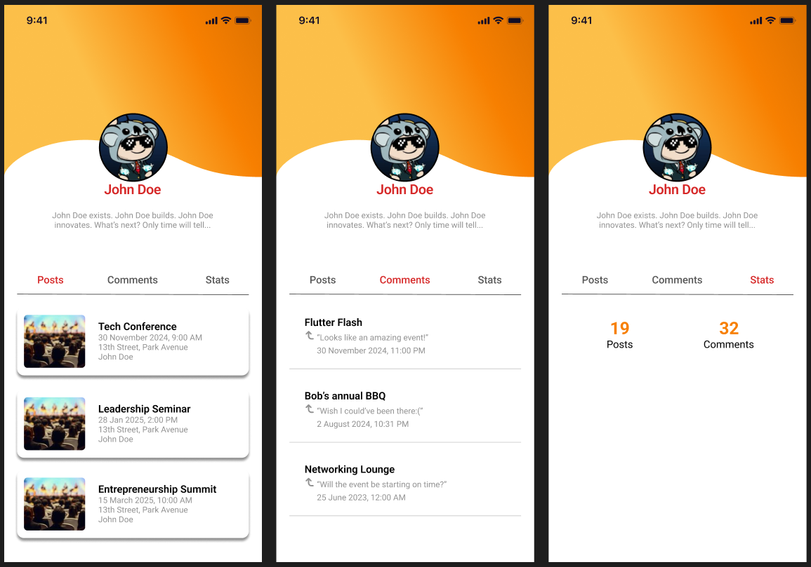
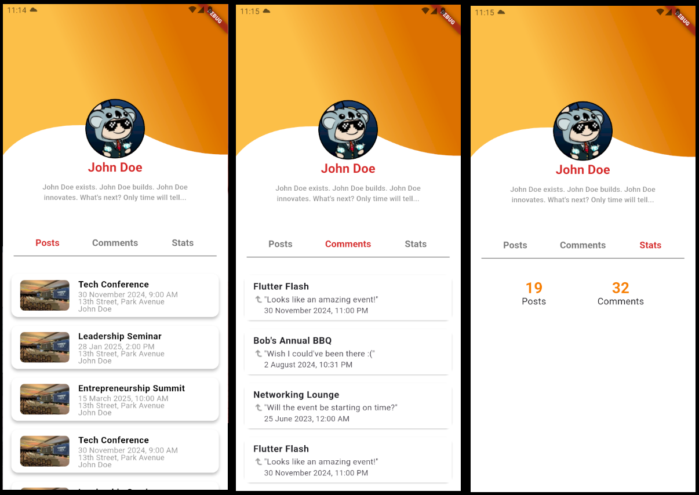

# Subata Naveen Khan - 18119
Assignment 1
### Instructions
#### Requirements  
- Your UI should closely follow the provided design on figma – you may use different images 
for the profile picture and events. 
- The app bar needs to be built in flutter, it can’t be an image.  
- Your design must have a single page, with the posts, comments, and stats sections being changed only according to what the user selects – the whole page must not be rebuilt.   
- The list of events and comments needs to be scrollable. 
#### Hints  
- Read up on the app bar’s shape property in the flutter docs 
- How can you **stack** the profile picture on top of the app bar?  
- How would you change the **state** of the UI when the user selects something? 
#### Provided Design

#### Grading Rubric 
- UI accuracy (colors, alignment, spacing, font style etc.) – 8 points 
- Code structure and readability – 1 point 
- Seamless UI updates – 1 point 
- Extra points for using the same font and making the arrow in the comment tile!
### My Design
[App Demo](App_Demo.mp4)
#### Marks: 9/10
#### Comments
- color of appbar
- aspect ratio of image in event tile
- arrow is an image
#### UI

